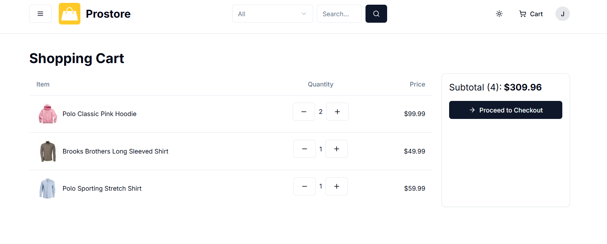

# Prostore

"Prostore" –an innovative e-commerce platform designed to transform the online shopping experience. 

## Table of contents

- [Overview](#overview)
  - [The app](#the-app)
  - [Screenshot](#screenshot)
  - [Built with](#built-with)
  - [Used Features](#used-features)
- [Author](#author)

## Overview
Welcome to Prostore, an innovative e-commerce platform designed to transform the online shopping experience. Our app caters to a wide range of consumers, looking for a convenient, reliable, and comprehensive online shopping solution.

Main Purpose: Prostore's primary goal is to provide a seamless and user-friendly platform where customers can explore a diverse range of products, from daily necessities to unique finds. We aim to streamline the shopping process, making it easier, faster, and more enjoyable for everyone.

### The app

Link for the app: https://prostore-zeta-lac.vercel.app/

Features:

- Responsive Design: Optimized for a smooth experience across all devices.
- Product Exploration: Browse through a wide range of products with detailed descriptions.
- Review System: Users can read and write reviews for products.
- Favorites & Shopping Cart: Add products to favorites or shopping cart.
- Order Processing: Seamless order placement with Stripe integration for payment processing.
- Advanced Filtering: Filter products by price, category, gender, size, and more.
- Personalization and Control: Users can easily update their personal information, such as email and shipping address, ensuring a personalized and hassle-free shopping experience.

### Screenshot

### Built with

- NextJs
- Prisma
- Next Auth
- Typescript
- PostgreSQL
- ShadCN UI

### Used Features
- REST API
- ES Lint
- Zod
- React Hook Form
- Stripe API
- Recharts
- Uploadthing

## Author

- LinkedIn - [Damla Kara](https://www.linkedin.com/in/damla-kara-348081232/)